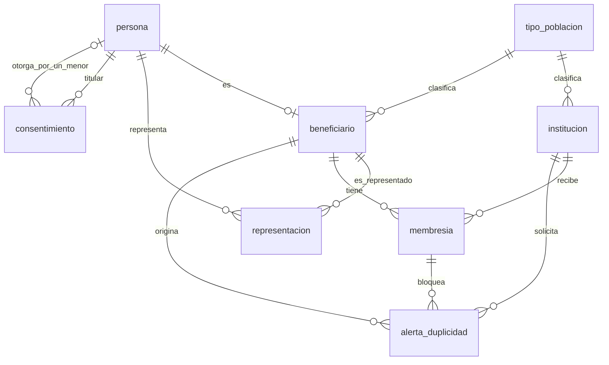

# Esquema de datos · SIGBA M2 · Instituciones y beneficiarios

2026-09-29 · versión 5.0 del esquema · schema PostgreSQL `beneficiarios` · propuesta, ver [ADR-15](../adr/ADR-15-persona-normalizada-con-documento-cifrado.md)

## 1. Qué es y cómo leerlo

Este documento dice qué tablas, restricciones y políticas tiene el schema `beneficiarios` y con qué migración o ticket entra cada pieza. Las secciones 4 a 7 son lo primero que se implementa (las migraciones A y B y las reglas de los services) y las secciones 8 y 9 describen lo que llega después. El porqué de cada decisión está en [decisiones.md](decisiones.md); aquí se cita el número (D-NN) solo cuando ayuda a buscarlo.

Las tablas de outbox, auditoría y usuarios no están aquí: son de `core` y de `plataforma`, y este esquema solo las nombra.

Para escribir la primera migración bastan el glosario (sección 2) y las secciones 4 a 7; las 8 y 9 se pueden saltar.

### La primera migración en una pantalla

Entra en la A: los enums `tipo_institucion` y `dia_semana`, las tablas `tipo_poblacion` e `institucion` y la política por banco de cada una (sección 5).

Entra en la B: las tablas `persona`, `beneficiario`, `representacion`, `consentimiento`, `membresia` y `alerta_duplicidad`, los enums `tipo_documento`, `sexo`, `parentesco`, `motivo_fin_representacion`, `motivo_fin_membresia` y `estado_alerta`, y las políticas de la sección 6.8.

No entra en ninguna de las dos:

- Los roles `sigba_*`, las funciones `SECURITY DEFINER`, las políticas por rol y el `GRANT` por columna (sección 8.1).
- `intento_registro` (sección 8.2), las columnas de resolución de `alerta_duplicidad` (sección 8.3) y `cerrar_membresia` (sección 8.4).
- El cifrado del documento, la supresión, la revocación del consentimiento y la tabla de comandos procesados (sección 9).
- Las columnas de la DIVIPOLA, porque su tabla no está especificada (sección 6.2).

## 2. Glosario

- **Persona.** Una fila por ser humano dentro de un banco, con su documento, nombre y contacto. La misma persona puede ser beneficiaria, representante de un menor o las dos cosas (D1).
- **Beneficiario.** El papel de persona atendida. Existe desde el primer registro, aunque después la persona no tenga membresía activa.
- **Institución.** Parroquia, comunidad religiosa o fundación que recoge alimento en el banco y lo reparte entre sus beneficiarios (SBA-26).
- **Membresía.** El vínculo entre un beneficiario y una institución. En todo el banco, un beneficiario tiene como máximo una membresía activa (SBA-15).
- **Representación.** El vínculo entre un menor y el adulto que lo representa. El representante no necesita ser beneficiario (SBA-32).
- **Consentimiento.** La evidencia de que el titular, o su representante si es menor, autorizó el tratamiento de sus datos. Las filas no se editan ni se borran: cada autorización nueva es otra fila.
- **Alerta de duplicidad.** La fila que se abre cuando se intenta registrar en una institución a alguien que ya tiene membresía activa en otra. La resuelve coordinación (SBA-28, SBA-47).
- **Supresión.** Borrar los datos que identifican a una persona cuando ella lo pide o vence el plazo de conservación, y dejar lo que necesitan los conteos. Entra antes del primer dato real (sección 9).
- **RLS** (seguridad por fila). Reglas de PostgreSQL, llamadas políticas, que deciden qué filas ve y escribe cada sesión. Aquí filtran por banco y, cuando el usuario pertenece a una institución, por institución. `FORCE ROW LEVEL SECURITY` hace que valgan también para el dueño de la tabla.
- **Contexto de tenant.** Tres variables que la API fija al abrir cada transacción con `set_config(clave, valor, true)`; el `true` hace que valgan solo dentro de esa transacción (Arquitectura 8.1). `app.banco_id` es el banco de la sesión. `app.institucion_id` es la institución del usuario, y va vacía para admin_banco, coordinación, operario y voluntario. `app.usuario_id` dice quién actúa; lo fija `core` desde SBA-18.
- **UNIQUE parcial.** Un índice único que solo mira las filas que cumplen su `WHERE`. `UNIQUE (beneficiario_id) WHERE fin_en IS NULL` impide dos membresías activas y deja convivir las cerradas.
- **Rol de conexión.** El usuario de PostgreSQL con el que se conecta la API. No debe ser dueño de las tablas ni tener `BYPASSRLS` (Arquitectura 8.1), para que las políticas valgan para él.
- **`SET ROLE`.** Cambia el rol de PostgreSQL con el que corre la sesión. `SET LOCAL ROLE` lo cambia solo hasta que termina la transacción.
- **Función `SECURITY DEFINER`.** Una función de PostgreSQL que corre con los privilegios de su dueño y no con los de quien la llama. Sirve para dejar que un rol haga una operación concreta sin darle el privilegio completo.
- **Política permisiva y restrictiva.** Las políticas permisivas de una tabla se suman con OR: basta que una deje pasar la fila. Una restrictiva se exige siempre, además de las permisivas.
- **Idempotencia de efecto.** Repetir la operación no duplica filas, aunque no devuelva el resultado de la primera vez.
- **M1, M2 y M3.** Los módulos del alcance: M1 es inventario, M2 es este módulo (instituciones y beneficiarios) y M3 es plataforma y analítica.
- **Demo 1 y demo 2.** La demo 1 es la del 1 de octubre de 2026, con las historias de las migraciones A y B. La demo 2 es la siguiente, con el portal de instituciones (SBA-44 y SBA-45).
- **HMAC del documento.** Ver la sección 9.

## 3. Fases

| Fase                       | Ticket                                                                                                                                  | Qué entra                                                                                                                                                                                                                   |
| -------------------------- | --------------------------------------------------------------------------------------------------------------------------------------- | --------------------------------------------------------------------------------------------------------------------------------------------------------------------------------------------------------------------------- |
| Migración A                | SBA-26, SBA-33                                                                                                                          | `tipo_poblacion` e `institucion` con política por banco. Desbloquea a M1, que elige institución en las salidas (SBA-38).                                                                                                    |
| Migración B                | SBA-27, SBA-28, SBA-32                                                                                                                  | `persona`, `beneficiario`, `representacion`, `consentimiento`, `membresia` y `alerta_duplicidad`, con sus enums, RLS por banco y visibilidad de la institución solo con membresía activa.                                   |
| Portal de instituciones    | SBA-44, SBA-45                                                                                                                          | Un rol de PostgreSQL por rol de aplicación, `sigba_funciones`, `buscar_persona` e `insertar_alta` con comparación del tipo de documento, políticas del rol institución con una restrictiva por banco y `GRANT` por columna. |
| Límite de intentos         | SBA-46                                                                                                                                  | `intento_registro` con lectura de las filas propias y el evento `AlertaDuplicidadAbierta`.                                                                                                                                  |
| Resolución de alertas      | SBA-47                                                                                                                                  | `resolucion`, `resuelta_por`, `resuelta_en` y el motivo de la resolución; el traslado.                                                                                                                                      |
| Retiro de la membresía     | SBA-48                                                                                                                                  | `cerrar_membresia`, que devuelve las alertas que descarta.                                                                                                                                                                  |
| Eventos y auditoría        | SBA-30, SBA-21                                                                                                                          | Outbox y `core.auditoria`.                                                                                                                                                                                                  |
| Antes del primer dato real | Ticket nuevo «Controles antes de datos reales», bloqueado por SBA-16. Espera además a SBA-31 y al ticket del almacenamiento del soporte | Los seis controles de la sección 9: protección del documento (SBA-31), soporte obligatorio del consentimiento, supresión, revocación, idempotencia completa y prueba de recuperación.                                       |

Ningún dato real entra antes de cerrar la fase «Antes del primer dato real». Hasta entonces la base solo tiene datos sintéticos (Arquitectura 7.1). Las fases del portal, de SBA-46 a SBA-48 y de eventos y auditoría pueden ir antes o después de ella.

## 4. Convenciones de las migraciones A y B

- Toda tabla lleva `banco_id uuid NOT NULL`, `ENABLE ROW LEVEL SECURITY`, `FORCE ROW LEVEL SECURITY` y al menos una política. Cada migración termina con `SELECT "core"."verificar_politicas_rls"();`, que ya existe en main y falla si una tabla con `banco_id` quedó sin RLS o sin política.
- Las PK son `uuid` con `DEFAULT gen_random_uuid()` y las fechas, `timestamptz`.
- Toda tabla que es destino de una FK tiene `UNIQUE (banco_id, id)`. Las FK son compuestas y siguen el orden de main: `FOREIGN KEY (banco_id, x_id) REFERENCES tabla (banco_id, id) ON DELETE RESTRICT ON UPDATE CASCADE`. PostgreSQL comprueba una FK sin aplicar RLS, así que una FK simple dejaría colgar una fila del banco A de una del banco B. En `schema.prisma`: `@relation(fields: [bancoId, xId], references: [bancoId, id])` y `@@unique([bancoId, id])` en el destino.
- Prisma no declara índices únicos parciales, índices sobre expresiones como `lower(nombre)`, CHECK ni políticas. Van a mano en el `migration.sql`.
- Las columnas de actor (`*_por`) son `varchar(100)` sin FK, como en inventario (D10). El service las llena con el `usuarioId` del contexto. Si SBA-21 decide antes de la migración B que el actor es un uuid, cambian todas juntas.
- Las columnas de texto son `varchar(n)`, como en main. La única excepción es `consentimiento.finalidad`, que es `text`.
- Ninguna tabla admite DELETE. La migración no concede privilegios, igual que las de main. El rol de conexión de la API recibe SELECT, INSERT y UPDATE sobre las tablas de `beneficiarios`, salvo `consentimiento`, que recibe solo SELECT e INSERT. En las pruebas lo hace `apps/api/test/rol-de-aplicacion.ts`, que hoy concede `plataforma` e `inventario` y tiene que sumar `beneficiarios` con esas reglas.
- Las políticas leen el contexto como las de main: `NULLIF(current_setting('app.banco_id', true), '')::uuid`. Sin contexto la expresión da NULL, la comparación no se cumple y la sesión no ve ni escribe filas.

## 5. Migración A (SBA-26 y SBA-33)

### 5.1 Enums de la A

| Enum               | Valores                                                                  |
| ------------------ | ------------------------------------------------------------------------ |
| `tipo_institucion` | `parroquia`, `comunidad_religiosa`, `fundacion`                          |
| `dia_semana`       | `lunes`, `martes`, `miercoles`, `jueves`, `viernes`, `sabado`, `domingo` |

Los dos viven en el schema `beneficiarios`. Agregar un valor es `ALTER TYPE ... ADD VALUE`; quitar uno exige una migración.

### 5.2 `tipo_poblacion`

Catálogo por banco: adultos mayores, familias, habitantes de calle. Lo administra coordinación. Antes de agregar un tipo, coordinación revisa que no permita deducir salud, religión, pertenencia étnica, condición migratoria, discapacidad ni victimización (RNF-M2-07, Arquitectura 8.6). La lista inicial la aprueba Cáritas; mientras tanto, `seed.ts` siembra una lista sintética en el banco de desarrollo.

| Columna  | Tipo         | Nulo | Notas                                                    |
| -------- | ------------ | ---- | -------------------------------------------------------- |
| id       | uuid         | no   | PK                                                       |
| banco_id | uuid         | no   | tenant                                                   |
| nombre   | varchar(100) | no   |                                                          |
| activo   | boolean      | no   | `DEFAULT true`. Uno inactivo no se ofrece y no se borra. |

Índices: UNIQUE `(banco_id, id)` y UNIQUE `(banco_id, lower(nombre))`.

### 5.3 `institucion`

Directorio de instituciones (SBA-26). Es lo que `InstitucionesService` expone a M1 (SBA-33).

| Columna           | Tipo             | Nulo | Notas                                                                                                            |
| ----------------- | ---------------- | ---- | ---------------------------------------------------------------------------------------------------------------- |
| id                | uuid             | no   | PK                                                                                                               |
| banco_id          | uuid             | no   | tenant                                                                                                           |
| nombre            | varchar(200)     | no   |                                                                                                                  |
| tipo              | tipo_institucion | no   |                                                                                                                  |
| contacto_nombre   | varchar(200)     | no   |                                                                                                                  |
| contacto_telefono | varchar(30)      | sí   |                                                                                                                  |
| contacto_correo   | varchar(200)     | sí   | Destino de la invitación del portal (SBA-44). Anulable: una parroquia sin correo también se da de alta.          |
| direccion         | varchar(500)     | sí   |                                                                                                                  |
| dia_recogida      | dia_semana       | sí   |                                                                                                                  |
| tipo_poblacion_id | uuid             | no   | FK compuesta a `tipo_poblacion`. Un solo tipo por institución (D8).                                              |
| activa            | boolean          | no   | `DEFAULT true`. Una inactiva no sale en `InstitucionesService.listarActivas` (SBA-26, criterio 1) y no se borra. |
| actualizado_por   | varchar(100)     | sí   | Actor del último cambio (SBA-26, criterio 2; D29).                                                               |
| actualizado_en    | timestamptz      | sí   | Fecha del último cambio. CHECK `(actualizado_por IS NULL) = (actualizado_en IS NULL)`.                           |

Índices: UNIQUE `(banco_id, id)`, UNIQUE `(banco_id, lower(nombre))` y `(banco_id, activa)` para el listado de M1.

FK: `(banco_id, tipo_poblacion_id) REFERENCES tipo_poblacion (banco_id, id)`.

### 5.4 Políticas de la A

Las dos tablas llevan la política por banco de main, sin condición de institución:

```sql
ALTER TABLE "beneficiarios"."tipo_poblacion" ENABLE ROW LEVEL SECURITY;
ALTER TABLE "beneficiarios"."tipo_poblacion" FORCE ROW LEVEL SECURITY;

CREATE POLICY tipo_poblacion_banco_isolation ON "beneficiarios"."tipo_poblacion"
    FOR ALL
    USING (
        banco_id = NULLIF(current_setting('app.banco_id', true), '')::uuid
    )
    WITH CHECK (
        banco_id = NULLIF(current_setting('app.banco_id', true), '')::uuid
    );
```

`institucion_banco_isolation` es igual sobre `"beneficiarios"."institucion"`. Con esta política, un usuario de institución ve todas las instituciones de su banco. El portal lo restringe a la suya (sección 8.1).

### 5.5 Pruebas de la A

Contra PostgreSQL y con el rol de `rol-de-aplicacion.ts`, sin superusuario ni `BYPASSRLS`:

- Las dos tablas tienen RLS activo y forzado.
- Con el contexto del banco A, las dos tablas dan cero filas del banco B, e insertar con `banco_id` de B falla.
- Una institución con un `tipo_poblacion_id` de otro banco falla por la FK compuesta.
- Un nombre repetido con otras mayúsculas falla en el mismo banco y se acepta en otro.
- `listarActivas` no devuelve instituciones inactivas (prueba del service).

## 6. Migración B (SBA-27, SBA-28 y SBA-32)

En la demo 1 registra coordinación (SBA-27), desde una sesión sin institución en el contexto. La B no crea roles ni funciones `SECURITY DEFINER`: con institución en el contexto, la base solo deja leer lo que la sección 6.8 permite.



### 6.1 Enums de la B

| Enum                        | Valores                                                                                                                                                                              | Nota                                                                                                                                                                            |
| --------------------------- | ------------------------------------------------------------------------------------------------------------------------------------------------------------------------------------ | ------------------------------------------------------------------------------------------------------------------------------------------------------------------------------- |
| `tipo_documento`            | `cc`, `ce`, `ti`, `pasaporte`, `registro_civil`, `pep`, `ppt`                                                                                                                        | Sin `otro`: un documento que no está en la lista no se registra. `ppt` es el permiso por protección temporal (D45); `pep` se conserva hasta que el Banco diga si aún lo recibe. |
| `sexo`                      | `masculino`, `femenino`, `prefiero_no_decirlo`                                                                                                                                       | Acordado el 2026-09-17.                                                                                                                                                         |
| `parentesco`                | `madre`, `padre`, `padrastro_madrastra`, `abuelo_a`, `bisabuelo_a`, `hermano_a`, `hermanastro_a`, `tio_a`, `tio_abuelo_a`, `primo_a`, `cunado_a`, `sobrino_a`, `tutor_legal`, `otro` | Los 14 valores, por decisión del dueño del repositorio. `tutor_legal` y `otro` cubren la custodia sin vínculo familiar.                                                         |
| `motivo_fin_representacion` | `mayoria_edad`, `cambio_representante`, `otro`                                                                                                                                       |                                                                                                                                                                                 |
| `motivo_fin_membresia`      | `se_mudo`, `dejo_de_asistir`, `fallecio`, `traslado`, `otro`                                                                                                                         | Los cuatro de SBA-48 más `traslado`, que solo asigna coordinación.                                                                                                              |
| `estado_alerta`             | `abierta`, `resuelta`, `descartada`                                                                                                                                                  | En la B toda alerta nace `abierta`. `resuelta` la usa SBA-47 y `descartada`, SBA-48.                                                                                            |

### 6.2 `persona`

Datos identificatorios y de contacto. Una fila por persona real dentro de un banco (D1).

| Columna          | Tipo           | Nulo | Notas                                                                                                                                                                                         |
| ---------------- | -------------- | ---- | --------------------------------------------------------------------------------------------------------------------------------------------------------------------------------------------- |
| id               | uuid           | no   | PK                                                                                                                                                                                            |
| banco_id         | uuid           | no   | tenant                                                                                                                                                                                        |
| tipo_documento   | tipo_documento | no   | Atributo que se puede cambiar: el paso de `ti` a `cc` es un UPDATE sobre la misma fila (D2). Solo lo cambia coordinación (sección 7.3).                                                       |
| numero_documento | varchar(20)    | no   | En claro y normalizado: solo dígitos y letras mayúsculas, sin puntos ni espacios. CHECK `numero_documento ~ '^[0-9A-Z]+$'`. Va en claro solo mientras haya datos sintéticos (D40, sección 9). |
| nombres          | varchar(100)   | no   |                                                                                                                                                                                               |
| apellidos        | varchar(100)   | no   |                                                                                                                                                                                               |
| sexo             | sexo           | no   |                                                                                                                                                                                               |
| fecha_nacimiento | date           | no   | La edad y el rango etario se calculan al leer; no se guardan.                                                                                                                                 |
| telefono         | varchar(30)    | sí   |                                                                                                                                                                                               |
| direccion        | varchar(500)   | sí   |                                                                                                                                                                                               |

Índices: UNIQUE `(banco_id, id)` y UNIQUE `(banco_id, numero_documento)`. La unicidad va sin el tipo de documento: en Colombia la tarjeta de identidad y la cédula que la persona recibe a los 18 tienen el mismo número, y con `(tipo, número)` la persona se partiría en dos filas (D2).

Riesgo propuesto, pendiente de Cáritas: dos personas distintas con el mismo número en tipos distintos chocan en el UNIQUE. Es poco probable por los rangos de numeración. Cuando pasa, el service no reutiliza a la persona, responde `tipo_distinto` y el caso lo revisa coordinación (sección 7.2). Si son dos personas, la segunda no se puede registrar mientras la unicidad sea por número. Cáritas decide si acepta este riesgo (sección 11).

**Columnas de la DIVIPOLA (D34).** `departamento_codigo char(2)` y `ciudad_codigo char(5)`, las dos anulables, con los códigos del DANE. Hoy la B no las lleva, porque la tabla global de la DIVIPOLA no está especificada (sección 11). Si alguien la especifica antes de escribir la B, con nombre, columnas, PK y siembra, entran en la B; si no, entran después con `ADD COLUMN`. Sus reglas, para cuando entren:

- CHECK `departamento_codigo ~ '^[0-9]{2}$'`.
- CHECK `ciudad_codigo ~ '^[0-9]{5}$' AND left(ciudad_codigo, 2) = departamento_codigo`.
- CHECK `ciudad_codigo IS NULL OR departamento_codigo IS NOT NULL`. Sin él, un departamento NULL vuelve NULL la comparación anterior y PostgreSQL la acepta.
- CHECK `direccion IS NULL OR ciudad_codigo IS NOT NULL`. Si las columnas entran cuando ya hay filas con dirección, este CHECK entra después de completar las ciudades.
- FK de `ciudad_codigo` a la tabla de la DIVIPOLA. Esa tabla no tiene `banco_id`: es una excepción a ADR-07 que ADR-15 acepta, con solo SELECT para los roles de aplicación.

### 6.3 `beneficiario`

El papel de persona atendida.

| Columna           | Tipo | Nulo | Notas                                                     |
| ----------------- | ---- | ---- | --------------------------------------------------------- |
| persona_id        | uuid | no   | PK. FK compuesta a `persona`.                             |
| banco_id          | uuid | no   | tenant. La FK compuesta lo obliga a ser el de la persona. |
| tipo_poblacion_id | uuid | no   | FK compuesta a `tipo_poblacion`.                          |

Índice: UNIQUE `(banco_id, persona_id)`, destino de las FK de `representacion`, `membresia` y `alerta_duplicidad`.

FK: `(banco_id, persona_id) REFERENCES persona (banco_id, id)` y `(banco_id, tipo_poblacion_id) REFERENCES tipo_poblacion (banco_id, id)`.

### 6.4 `representacion`

Vínculo entre un menor y su representante (SBA-32).

| Columna                  | Tipo                      | Nulo | Notas                                                                      |
| ------------------------ | ------------------------- | ---- | -------------------------------------------------------------------------- |
| id                       | uuid                      | no   | PK                                                                         |
| banco_id                 | uuid                      | no   | tenant                                                                     |
| beneficiario_id          | uuid                      | no   | El menor. FK compuesta a `beneficiario`.                                   |
| representante_persona_id | uuid                      | no   | FK compuesta a `persona`. No necesita ser beneficiario ni tener membresía. |
| parentesco               | parentesco                | no   |                                                                            |
| inicio_en                | timestamptz               | no   | `DEFAULT now()`                                                            |
| fin_en                   | timestamptz               | sí   | NULL mientras el vínculo está vigente.                                     |
| motivo_fin               | motivo_fin_representacion | sí   |                                                                            |

CHECK:

- `representante_persona_id <> beneficiario_id`.
- `fin_en >= inicio_en`.
- `(fin_en IS NULL) = (motivo_fin IS NULL)`.

Índices: UNIQUE `(beneficiario_id, representante_persona_id) WHERE fin_en IS NULL`, que impide duplicar el mismo vínculo vigente; un menor puede tener dos representantes vigentes, como madre y padre. `(representante_persona_id) WHERE fin_en IS NULL`, para la política de `persona`.

FK: `(banco_id, beneficiario_id) REFERENCES beneficiario (banco_id, persona_id)` y `(banco_id, representante_persona_id) REFERENCES persona (banco_id, id)`.

### 6.5 `consentimiento`

Evidencia de cada autorización de tratamiento (SBA-27, SBA-32, Arquitectura 8.6). Solo admite INSERT: ninguna política ni ningún privilegio permite UPDATE o DELETE, como `movimiento` en ADR-08. Un representante nuevo o una versión nueva del aviso agregan una fila y la anterior se conserva.

| Columna              | Tipo         | Nulo | Notas                                                                                                                                                           |
| -------------------- | ------------ | ---- | --------------------------------------------------------------------------------------------------------------------------------------------------------------- |
| id                   | uuid         | no   | PK                                                                                                                                                              |
| banco_id             | uuid         | no   | tenant                                                                                                                                                          |
| persona_id           | uuid         | no   | Titular de los datos. FK compuesta a `persona`.                                                                                                                 |
| otorgante_persona_id | uuid         | sí   | Quien autoriza por el titular. NULL significa que autoriza el titular. FK compuesta a `persona`. Para un menor es obligatorio (sección 7.6).                    |
| recogido_por         | varchar(100) | no   | Usuario que recogió el consentimiento.                                                                                                                          |
| otorgado_en          | timestamptz  | no   | `DEFAULT now()` (SBA-27, criterio 2).                                                                                                                           |
| version_aviso        | varchar(20)  | no   | Versión del aviso de privacidad que se mostró (SBA-16).                                                                                                         |
| finalidad            | text         | no   |                                                                                                                                                                 |
| soporte_clave        | varchar(100) | sí   | Clave del objeto (firma, foto o grabación) en el almacén privado. Anulable hasta que existan el almacén y la subida; NOT NULL antes del primer dato real (D43). |

CHECK `otorgante_persona_id <> persona_id`.

Índice: `(banco_id, persona_id, otorgado_en DESC)`. La fila más reciente dice qué versión del aviso aceptó la persona.

FK: `(banco_id, persona_id)` y `(banco_id, otorgante_persona_id)`, las dos a `persona (banco_id, id)`.

### 6.6 `membresia`

Vínculo entre beneficiario e institución. Regla central del módulo: una sola membresía activa por beneficiario (SBA-15, SBA-28).

| Columna         | Tipo                 | Nulo | Notas                                                                                                 |
| --------------- | -------------------- | ---- | ----------------------------------------------------------------------------------------------------- |
| id              | uuid                 | no   | PK                                                                                                    |
| banco_id        | uuid                 | no   | tenant                                                                                                |
| beneficiario_id | uuid                 | no   | FK compuesta a `beneficiario`.                                                                        |
| institucion_id  | uuid                 | no   | FK compuesta a `institucion`. Base de la visibilidad de la institución.                               |
| inicio_en       | timestamptz          | no   | `DEFAULT now()`                                                                                       |
| fin_en          | timestamptz          | sí   | NULL mientras está activa. Es la única marca de estado.                                               |
| motivo_fin      | motivo_fin_membresia | sí   | Sin texto libre: un campo abierto sobre por qué alguien se fue acumularía datos de salud y de riesgo. |
| creado_por      | varchar(100)         | no   | Usuario que la activó.                                                                                |
| cerrado_por     | varchar(100)         | sí   | Usuario que la cerró.                                                                                 |

CHECK:

- `fin_en >= inicio_en`.
- `(fin_en IS NULL) = (motivo_fin IS NULL) AND (fin_en IS NULL) = (cerrado_por IS NULL)`.

Índices:

- UNIQUE `(banco_id, id)`, destino de la FK de `alerta_duplicidad`.
- UNIQUE `(beneficiario_id) WHERE fin_en IS NULL`. Cumple SBA-15, criterio 1: la segunda membresía activa falla en la base.
- `(institucion_id, fin_en)`, para la política y la lista de la institución.
- `(beneficiario_id, inicio_en DESC)`, para el historial.

FK: `(banco_id, beneficiario_id) REFERENCES beneficiario (banco_id, persona_id)` y `(banco_id, institucion_id) REFERENCES institucion (banco_id, id)`.

Volver a la misma institución meses después crea una fila nueva y la anterior conserva su cierre (SBA-28, criterio 3; SBA-48, criterio 1). Mientras no llegue SBA-48, coordinación cierra con un UPDATE del service (sección 7.8).

### 6.7 `alerta_duplicidad`

Se abre cuando se intenta registrar en una institución a alguien que ya tiene membresía activa en otra (SBA-28).

| Columna                    | Tipo          | Nulo | Notas                                                                                                                 |
| -------------------------- | ------------- | ---- | --------------------------------------------------------------------------------------------------------------------- |
| id                         | uuid          | no   | PK                                                                                                                    |
| banco_id                   | uuid          | no   | tenant                                                                                                                |
| beneficiario_id            | uuid          | no   | FK compuesta a `beneficiario`.                                                                                        |
| institucion_solicitante_id | uuid          | no   | FK compuesta a `institucion`. La institución donde se intentó el alta.                                                |
| membresia_vigente_id       | uuid          | no   | FK compuesta a `membresia`. La membresía que estaba activa cuando se abrió la alerta; más tarde puede quedar cerrada. |
| estado                     | estado_alerta | no   | `DEFAULT 'abierta'`                                                                                                   |
| creado_en                  | timestamptz   | no   | `DEFAULT now()`. Antigüedad en la bandeja de coordinación.                                                            |
| creado_por                 | varchar(100)  | no   |                                                                                                                       |

Índices:

- UNIQUE `(beneficiario_id, institucion_solicitante_id) WHERE estado = 'abierta'`: una sola alerta abierta por persona e institución.
- `(banco_id, estado, creado_en)`, para la bandeja.

FK: `(banco_id, beneficiario_id) REFERENCES beneficiario (banco_id, persona_id)`, `(banco_id, institucion_solicitante_id) REFERENCES institucion (banco_id, id)` y `(banco_id, membresia_vigente_id) REFERENCES membresia (banco_id, id)`.

### 6.8 Políticas RLS de la B

Las seis tablas llevan `ENABLE` y `FORCE ROW LEVEL SECURITY`. La regla es la misma en todas:

- Sin institución en el contexto (admin_banco, coordinación, operario y voluntario), la sesión ve y escribe todo su banco.
- Con institución en el contexto, la sesión solo lee, y solo lo que cuelga de una membresía **activa** en esa institución (D46). No lee lo de quien se fue.

Todas comparten el WITH CHECK, que exige el banco y ninguna institución en el contexto. Así un usuario de institución no escribe nada en la base hasta el portal. El motivo: PostgreSQL comprueba una FK sin aplicar RLS, y con solo la condición de banco una institución podría crear una membresía sobre un beneficiario que no ve. El responsable de arquitectura la confirmó (D50).

```sql
    WITH CHECK (
        banco_id = NULLIF(current_setting('app.banco_id', true), '')::uuid
        AND NULLIF(current_setting('app.institucion_id', true), '') IS NULL
    );
```

`membresia`: la institución ve sus membresías activas. La condición no consulta la propia tabla, porque PostgreSQL rechaza por recursión una política que se consulta a sí misma.

```sql
CREATE POLICY membresia_isolation ON "beneficiarios"."membresia"
    FOR ALL
    USING (
        banco_id = NULLIF(current_setting('app.banco_id', true), '')::uuid
        AND (
            NULLIF(current_setting('app.institucion_id', true), '') IS NULL
            OR (
                institucion_id = NULLIF(current_setting('app.institucion_id', true), '')::uuid
                AND fin_en IS NULL
            )
        )
    )
    WITH CHECK (
        banco_id = NULLIF(current_setting('app.banco_id', true), '')::uuid
        AND NULLIF(current_setting('app.institucion_id', true), '') IS NULL
    );
```

`beneficiario`: visible con una membresía activa en la institución.

```sql
CREATE POLICY beneficiario_isolation ON "beneficiarios"."beneficiario"
    FOR ALL
    USING (
        banco_id = NULLIF(current_setting('app.banco_id', true), '')::uuid
        AND (
            NULLIF(current_setting('app.institucion_id', true), '') IS NULL
            OR EXISTS (
                SELECT 1 FROM "beneficiarios"."membresia" m
                WHERE m.beneficiario_id = beneficiario.persona_id
                  AND m.fin_en IS NULL
                  AND m.institucion_id = NULLIF(current_setting('app.institucion_id', true), '')::uuid
            )
        )
    )
    WITH CHECK (
        banco_id = NULLIF(current_setting('app.banco_id', true), '')::uuid
        AND NULLIF(current_setting('app.institucion_id', true), '') IS NULL
    );
```

`representacion`: la misma condición sobre `representacion.beneficiario_id`, con la política `representacion_isolation`.

`persona`: visible si es beneficiaria con membresía activa en la institución, o si es representante vigente de un beneficiario con membresía activa en ella (D39).

```sql
CREATE POLICY persona_isolation ON "beneficiarios"."persona"
    FOR ALL
    USING (
        banco_id = NULLIF(current_setting('app.banco_id', true), '')::uuid
        AND (
            NULLIF(current_setting('app.institucion_id', true), '') IS NULL
            OR EXISTS (
                SELECT 1 FROM "beneficiarios"."membresia" m
                WHERE m.beneficiario_id = persona.id
                  AND m.fin_en IS NULL
                  AND m.institucion_id = NULLIF(current_setting('app.institucion_id', true), '')::uuid
            )
            OR EXISTS (
                SELECT 1
                FROM "beneficiarios"."representacion" r
                JOIN "beneficiarios"."membresia" m ON m.beneficiario_id = r.beneficiario_id
                WHERE r.representante_persona_id = persona.id
                  AND r.fin_en IS NULL
                  AND m.fin_en IS NULL
                  AND m.institucion_id = NULLIF(current_setting('app.institucion_id', true), '')::uuid
            )
        )
    )
    WITH CHECK (
        banco_id = NULLIF(current_setting('app.banco_id', true), '')::uuid
        AND NULLIF(current_setting('app.institucion_id', true), '') IS NULL
    );
```

`consentimiento`: dos políticas, porque la tabla solo admite SELECT e INSERT. La subconsulta sobre `persona` pasa por la política de `persona`, así que la condición se lee «la institución ve al titular».

```sql
CREATE POLICY consentimiento_lectura ON "beneficiarios"."consentimiento"
    FOR SELECT
    USING (
        banco_id = NULLIF(current_setting('app.banco_id', true), '')::uuid
        AND (
            NULLIF(current_setting('app.institucion_id', true), '') IS NULL
            OR EXISTS (
                SELECT 1 FROM "beneficiarios"."persona" p
                WHERE p.id = consentimiento.persona_id
            )
        )
    );

CREATE POLICY consentimiento_insercion ON "beneficiarios"."consentimiento"
    FOR INSERT
    WITH CHECK (
        banco_id = NULLIF(current_setting('app.banco_id', true), '')::uuid
        AND NULLIF(current_setting('app.institucion_id', true), '') IS NULL
    );
```

`alerta_duplicidad`: con institución en el contexto no se ve nada. La alerta revela en qué otra institución está la persona (RNF-M2-05).

```sql
CREATE POLICY alerta_duplicidad_isolation ON "beneficiarios"."alerta_duplicidad"
    FOR ALL
    USING (
        banco_id = NULLIF(current_setting('app.banco_id', true), '')::uuid
        AND NULLIF(current_setting('app.institucion_id', true), '') IS NULL
    )
    WITH CHECK (
        banco_id = NULLIF(current_setting('app.banco_id', true), '')::uuid
        AND NULLIF(current_setting('app.institucion_id', true), '') IS NULL
    );
```

Límite aceptado hasta el portal: la base no distingue a admin_banco ni a coordinación de operario ni de voluntario, porque ninguno trae institución en el contexto. Solo el `RolesGuard` de la API impide que un voluntario registre beneficiarios. Con datos sintéticos se acepta; el portal lo cierra con roles de PostgreSQL (sección 8.1).

### 6.9 Pruebas de la B

Contra PostgreSQL, con el rol de `rol-de-aplicacion.ts`:

- Las seis tablas tienen RLS activo y forzado.
- Por cada tabla, el contexto del banco A da cero filas del banco B, e insertar con `banco_id` de B falla.
- Una membresía del banco A con una institución del banco B falla por la FK compuesta.
- La segunda membresía activa del mismo beneficiario falla (SBA-15, criterio 1). Una cerrada y una activa conviven.
- SBA-15, criterio 2: con `app.institucion_id` de X, una persona con membresía activa solo en Y da cero filas en `persona`, `beneficiario`, `membresia`, `representacion` y `consentimiento`.
- Con `app.institucion_id` de X, una persona cuya membresía en X está cerrada da cero filas en las mismas tablas.
- El representante vigente de un menor con membresía activa en X es visible para X. Deja de serlo cuando se cierra la representación o la membresía del menor.
- Con institución en el contexto, INSERT falla en las seis tablas. UPDATE sobre una fila visible falla por el WITH CHECK; sobre una fila invisible, como las de `alerta_duplicidad`, no da error y afecta cero filas. `alerta_duplicidad` da cero filas en SELECT.
- El mismo número en el mismo banco falla por el UNIQUE, aunque cambie el tipo; en otro banco se acepta.
- Un número con puntos, espacios o minúsculas falla por el CHECK.
- UPDATE y DELETE sobre `consentimiento` fallan con el rol de la API.
- Una segunda alerta abierta para la misma persona e institución falla.

## 7. Reglas de los services

La base no puede expresar estas reglas. Van en los services, con TDD y dentro de la cobertura de `services/` (RNF-02). Cada escritura de negocio corre en una sola transacción con el cliente de `executeTransactionWithTenant`, y auditoría y outbox entran en esa misma transacción cuando existan (SBA-21, SBA-30). Esa transacción controlada por el service todavía no existe: hoy cada método del repositorio abre la suya (sección 10). Hay que construirla antes de la B.

### 7.1 Normalización del documento

El DTO del alta y el de la búsqueda quitan puntos, guiones y espacios del número y lo pasan a mayúsculas antes de validar (ADR-04). Si lo que queda no cumple `^[0-9A-Z]+$`, la API responde 400. Así el service busca e inserta siempre el valor que exige el CHECK de `persona.numero_documento`, y «1.088.123.456» encuentra a la persona guardada como `1088123456`.

Dónde: los DTO de `dto/` · Prueba: unitaria · Ticket: SBA-27.

### 7.2 Alta y duplicidad

En la demo 1 registra coordinación, sin institución en el contexto, y la institución de la membresía llega como `institucion_id` en el DTO del alta. Con el portal sale del contexto.

1. El service busca a la persona por `(banco_id, numero_documento)`.
2. Si la persona existe con otro tipo de documento, no la reutiliza, no escribe nada y devuelve `tipo_distinto`. Coordinación decide si es la misma persona, por ejemplo en el paso de `ti` a `cc` (sección 7.3), o un choque entre dos personas. Si son dos, la segunda no se puede registrar mientras la unicidad sea por número (D2), y el caso queda fuera del sistema hasta que Cáritas decida (sección 11).
3. Consulta la membresía activa del beneficiario **antes** de insertar. No depende del error del UNIQUE, porque después de ese error PostgreSQL deja la transacción abortada y ya no se puede escribir la alerta.
4. Sin membresía activa, inserta lo que falte (persona, beneficiario, representación y consentimientos) y la membresía, y devuelve `creada`.
5. Con la membresía activa en la misma institución, no escribe nada y devuelve `ya_activa`.
6. Con la membresía activa en otra institución, inserta la alerta con `INSERT … ON CONFLICT (beneficiario_id, institucion_solicitante_id) WHERE estado = 'abierta' DO NOTHING` y devuelve `duplicidad`.
7. La transacción confirma en todos los casos, también con `duplicidad`, para que la alerta que exige SBA-28 quede guardada.
8. El controlador traduce el resultado a HTTP después del commit:

| Resultado       | HTTP | Respuesta                                                                                                |
| --------------- | ---- | -------------------------------------------------------------------------------------------------------- |
| `creada`        | 201  | La membresía nueva.                                                                                      |
| `ya_activa`     | 200  | La membresía que ya existía.                                                                             |
| `duplicidad`    | 409  | Un mensaje que no nombra la otra institución.                                                            |
| `tipo_distinto` | 409  | Un código propio, distinto del de `duplicidad`, para que la PWA diga que el caso lo revisa coordinación. |

Dos altas simultáneas pueden pasar las dos la consulta del paso 3 y chocar después en un UNIQUE: el de membresía activa, o el de `persona (banco_id, numero_documento)` cuando las dos crean a la misma persona nueva. La segunda transacción se revierte entera, sin alerta, y la API responde 409 al error de Prisma `P2002`. Su reintento repite la consulta y, si corresponde, abre la alerta.

Dónde: `BeneficiariosService.registrar` · Prueba: unitaria del service; de integración, después de una duplicidad hay una alerta abierta · Ticket: SBA-28, y SBA-27 para `tipo_distinto`.

### 7.3 Cambio de tipo de documento

Solo coordinación, sobre la misma persona y sin cambiar el número. Es lo que permite que la unicidad vaya sin el tipo (D2). Hasta el portal la base no distingue el rol, y lo impide `@Roles()`.

Dónde: `PersonasService.actualizarDocumento` · Prueba: unitaria · Ticket: por asignar (sección 11).

### 7.4 Menor sin representante

Un menor, con menos de 18 años según `fecha_nacimiento`, sin representación vigente se rechaza.

Dónde: `BeneficiariosService.registrar` · Prueba: unitaria · Ticket: SBA-32, criterio 1.

### 7.5 Edad del representante

El representante, nuevo o existente, y el otorgante del consentimiento de un menor tienen 18 años o más, en el alta y en los vínculos que coordinación crea después (D39).

Dónde: `BeneficiariosService.registrar` y el vínculo que crea coordinación · Prueba: unitaria · Ticket: SBA-27 y SBA-32.

### 7.6 Consentimiento en el alta

El alta inserta la fila de `consentimiento` en la misma transacción; sin ella no hay alta. Para un menor, `otorgante_persona_id` es un representante con representación vigente sobre ese beneficiario. Un representante nuevo firma su propio consentimiento: otra fila con él como titular y el mismo `soporte_clave` (D48). `soporte_clave` puede ir vacío hasta que exista el almacén (D43).

Dónde: `BeneficiariosService.registrar` · Prueba: unitaria · Ticket: SBA-27 y SBA-32.

### 7.7 Mayoría de edad

Se deriva al leer: una representación vigente cuyo menor ya tiene 18 años se muestra como histórica. La siguiente escritura sobre ese beneficiario la cierra con `motivo_fin = mayoria_edad`. No hay tarea programada.

Dónde: `BeneficiariosService`, al leer y al escribir · Prueba: unitaria · Ticket: SBA-32, criterio 3.

### 7.8 Cierre de membresía

Hasta SBA-48 cierra coordinación con un UPDATE que exige `fin_en IS NULL`; una membresía cerrada no se reabre. El DTO recibe el motivo tipificado, sin texto libre, y rechaza el cierre sin motivo. Las alertas abiertas que apuntan a la membresía cerrada siguen abiertas hasta que SBA-48 agregue el descarte.

Dónde: `MembresiasService.cerrar` y `CerrarMembresiaDto` · Prueba: unitaria e integración · Ticket: SBA-28, que necesita el cierre para su criterio 3.

### 7.9 Idempotencia

La regla es la de Arquitectura 6.1: toda escritura de negocio registra `(banco_id, comando_id)`, el hash de la carga y el resultado; con la misma carga devuelve el resultado previo y con otra carga responde 409.

Excepción temporal: mientras `core` no tenga la tabla de comandos procesados, los UNIQUE dan idempotencia de efecto. Un alta repetida encuentra la membresía activa y devuelve `ya_activa`; una alerta repetida choca con `ON CONFLICT`; una institución o un tipo de población repetidos chocan con `lower(nombre)`.

La PWA todavía no tiene cola de comandos (`apps/web/src/offline/README.md`). Cuando llegue, cada carga lleva un `comando_id` UUIDv7 que se repite en los reintentos, y un formulario corregido lleva otro. Hasta entonces los DTO de M2 no lo piden.

Dónde: todos los services de escritura · Prueba: unitaria de cada caso repetido · Ticket: la excepción vale desde la A; la idempotencia completa entra con «Controles antes de datos reales» (sección 9).

### 7.10 Directorio para M1

`InstitucionesService.listarActivas(banco)` y `obtener(id)` son de solo lectura y salen por `beneficiarios/index.ts`, que no exporta nada más a `inventario`.

Dónde: `InstitucionesService` · Prueba: unitaria · Ticket: SBA-26 y SBA-33.

### 7.11 Datos personales fuera de logs

Ningún dato de `persona` va a logs, trazas de Sentry, cargas de evento ni mensajes de error (Arquitectura 8.6).

Dónde: todos los services y controladores · Prueba: revisión de código · Ticket: cada ticket de M2 que lea o escriba `persona`.

## 8. Fases posteriores

### 8.1 Portal de instituciones (SBA-44 y SBA-45)

El rol institución escribe desde el portal, y la base tiene que distinguirlo de coordinación. Entra lo que las migraciones A y B dejaron fuera.

**Roles de PostgreSQL.** Los roles `sigba_*` son `NOLOGIN`: nadie se conecta con ellos, la API entra con `SET ROLE`. Ninguno, tampoco el rol de conexión, tiene `BYPASSRLS`.

| Rol                  | Lo usa                                                              | Privilegios en `beneficiarios`                                                                                                                                                                                                                   |
| -------------------- | ------------------------------------------------------------------- | ------------------------------------------------------------------------------------------------------------------------------------------------------------------------------------------------------------------------------------------------ |
| rol de conexión      | operario, voluntario y el resto de la API, sin SET ROLE             | Conserva lo que tiene en `plataforma`, `inventario` y `core`. En `beneficiarios`, solo SELECT de `(id, nombre, tipo, activa, dia_recogida)` sobre `institucion`, para que M1 elija destinatario.                                                 |
| `sigba_coordinacion` | `admin_banco` y `coordinacion`, en transacciones de `beneficiarios` | Lo que la B daba al rol de conexión. Los dos roles de aplicación tienen los mismos permisos en la base; los distingue `@Roles()`.                                                                                                                |
| `sigba_institucion`  | `institucion`, en transacciones de `beneficiarios`                  | SELECT sobre `tipo_poblacion` e `institucion` con sus políticas por banco, que el formulario del alta necesita; SELECT sobre las tablas de la B según sus políticas; UPDATE por columna en `persona` y EXECUTE de las funciones de esta sección. |
| `sigba_funciones`    | Dueño de las funciones `SECURITY DEFINER`                           | SELECT, INSERT y UPDATE en las tablas que tocan las funciones, con política por banco.                                                                                                                                                           |
| `sigba_tareas`       | Tareas de fondo que toquen `beneficiarios`                          | Lo que pida cada tarea, siempre con contexto de banco. Hoy no hay ninguna; la primera sería el consumo de `SalidaRegistrada`.                                                                                                                    |

**Cómo cambia de rol la API (D26, D41, D51).**

1. `GRANT sigba_coordinacion, sigba_institucion, sigba_tareas TO <rol de conexión> WITH INHERIT FALSE, SET TRUE`. En PostgreSQL 16 un miembro hereda los privilegios del rol si no se dice `INHERIT FALSE`, y una transacción sin `SET ROLE` recibiría los de coordinación.
2. `fijarContexto` hace `SET LOCAL ROLE sigba_coordinacion` cuando `ctx.rol` es `admin_banco` o `coordinacion`, y `SET LOCAL ROLE sigba_institucion` cuando es `institucion`. Con cualquier otro rol no cambia de rol. Las tareas de fondo usan `sigba_tareas`.
3. El cambio de rol solo ocurre en las transacciones que abre el módulo `beneficiarios`, por ejemplo con una opción de `executeTransactionWithTenant` que solo pasan sus repositorios. Las transacciones de `plataforma` e `inventario` siguen con el rol de conexión para todos los roles (D51). Sin esto, un admin_banco que crea una bodega o una coordinación que aprueba un precio correrían como `sigba_coordinacion`, que no tiene privilegios en esos schemas, y fallarían.
4. Los roles `sigba_*` reciben USAGE sobre `core` y el camino para insertar en outbox y auditoría que definan SBA-30 y SBA-21. Después de `SET ROLE` dejan de valer los privilegios del rol de conexión: si una transacción de `beneficiarios` necesita leer otro schema, el rol `sigba_*` recibe ese SELECT concreto.
5. El guard de roles (SBA-18) lee `plataforma.usuario` fuera de toda transacción; ese camino sigue con el rol de conexión y no se toca.

**Políticas que se agregan.** Las de la B se conservan.

- En cada tabla, una política restrictiva por banco. Las políticas permisivas de una tabla se suman con OR, y la restrictiva se exige siempre, así que una política nueva mal escrita, o una asignación con una institución de otro banco, no abre el banco ajeno:

  ```sql
  CREATE POLICY persona_banco_restrictiva ON "beneficiarios"."persona"
      AS RESTRICTIVE
      FOR ALL
      USING (
          banco_id = NULLIF(current_setting('app.banco_id', true), '')::uuid
      )
      WITH CHECK (
          banco_id = NULLIF(current_setting('app.banco_id', true), '')::uuid
      );
  ```

- `institucion`: una política restrictiva `FOR SELECT TO sigba_institucion USING (id = NULLIF(current_setting('app.institucion_id', true), '')::uuid)`. La institución ve solo su fila.
- `persona`: `GRANT UPDATE (nombres, apellidos, telefono, direccion) ON persona TO sigba_institucion`, más las columnas de la DIVIPOLA si ya existen (D17), y una política `FOR UPDATE TO sigba_institucion` con la condición de membresía activa en USING y en WITH CHECK. El tipo y el número de documento quedan fuera.
- Políticas `TO sigba_funciones` con la condición de banco, para que las funciones lean y escriban lo que el rol institución no puede.

**Funciones `SECURITY DEFINER`.** Su dueño es `sigba_funciones`, corren con `search_path` fijo, llevan `REVOKE EXECUTE ... FROM PUBLIC` (PostgreSQL concede EXECUTE a PUBLIC por defecto) y `GRANT EXECUTE ... TO sigba_institucion`. Solo hacen lo que necesita privilegio; las decisiones siguen en los services (D28). Coordinación no las usa: escribe con sus privilegios.

| Función                                                                                                | Qué hace                                                                                                                                                                                                                                                                                                                                                                                                                                                                       |
| ------------------------------------------------------------------------------------------------------ | ------------------------------------------------------------------------------------------------------------------------------------------------------------------------------------------------------------------------------------------------------------------------------------------------------------------------------------------------------------------------------------------------------------------------------------------------------------------------------ |
| `buscar_persona(p_numero_documento, p_tipo_documento)`                                                 | Con el contexto de la institución, dice si la persona existe, si ya es beneficiaria y, si tiene membresía activa, si es en esta institución. Nunca devuelve la otra institución ni datos de la persona. Si el número existe con otro tipo, devuelve `tipo_distinto` sin `persona_id`, y el service responde que el caso lo revisa coordinación.                                                                                                                                |
| `insertar_alta(p_persona, p_tipo_documento, p_consentimientos, p_tipo_poblacion_id, p_representacion)` | Inserta lo que falte de `persona`, `beneficiario`, `consentimiento`, `representacion` y la `membresia` en la institución del contexto. Si la persona ya existe con otro tipo, lanza excepción. Un representante que ya existe debe tener membresía activa en la institución o ser representante vigente de otro beneficiario con membresía activa en ella (D39). Si otra membresía activa viola el UNIQUE, la excepción llega al service, que ya consultó antes (sección 7.2). |

`cerrar_membresia` entra con SBA-48 (sección 8.4).

Las funciones `core.banco_id()`, `core.institucion_id()` y `core.usuario_id()`, que leerían el contexto y lanzarían excepción si falta el banco (D27), no existen en main. Se deciden aquí, con SBA-45, criterio 2 (una tarea de fondo sin contexto falla).

Antes de abrir el portal hay que resolver un caso: la política de `persona` sigue mostrando al representante de un menor que ya cumplió 18 mientras nadie cierre la representación. La política tiene que considerar la edad, o el cierre tiene que ocurrir antes.

**Pruebas del portal.**

- Un voluntario lista las instituciones activas con el rol de conexión, sin `SET ROLE`.
- Una transacción sin `SET ROLE` no tiene los privilegios de `sigba_coordinacion`: un INSERT en `persona` falla por privilegio.
- Con el portal activo, un admin_banco crea una bodega (`plataforma`) y una coordinación registra un donante (`inventario`). Esas transacciones no cambian de rol y funcionan.
- Con `app.banco_id` del banco A y una institución del banco B en `app.institucion_id`, las seis tablas de la B y `institucion`, leída como `sigba_institucion`, dan cero filas. `tipo_poblacion` da solo filas del banco A.
- `buscar_persona` con un tipo distinto del guardado no devuelve la persona, e `insertar_alta` con ese tipo falla.
- UPDATE de `persona.tipo_documento` como `sigba_institucion` falla por privilegio de columna.
- `insertar_alta` con el contexto de A no crea una membresía en B.
- `insertar_alta` con el contexto de X y un representante existente que solo tiene membresía en Y falla, y esa persona sigue sin ser visible para X.
- EXECUTE de las funciones como rol de conexión falla.
- `sigba_institucion` ve solo su fila de `institucion`.

### 8.2 Límite de intentos (SBA-46)

Tabla `intento_registro`:

| Columna        | Tipo              | Nulo | Notas                                                           |
| -------------- | ----------------- | ---- | --------------------------------------------------------------- |
| id             | uuid              | no   | PK                                                              |
| banco_id       | uuid              | no   | tenant                                                          |
| usuario_id     | varchar(100)      | no   | Clave del límite.                                               |
| institucion_id | uuid              | sí   | FK compuesta a `institucion`. NULL si actúa coordinación.       |
| resultado      | resultado_intento | no   | `persona_nueva`, `persona_existente`, `duplicidad`, `limitado`. |
| creado_en      | timestamptz       | no   | `DEFAULT now()`                                                 |

Índice: `(banco_id, usuario_id, creado_en DESC)`.

La tabla no guarda el documento consultado ni la persona encontrada (D19, D24). La política deja a cada usuario leer e insertar solo sus filas: USING y WITH CHECK con el banco y `usuario_id = NULLIF(current_setting('app.usuario_id', true), '')`, y el WITH CHECK exige además que `institucion_id` sea la del contexto o NULL si el contexto no trae institución. No hace falta función privilegiada.

Regla del service: cuentan todas las consultas por documento, las de buscar y las de registrar. Si el usuario lleva 10 o más en el último minuto, el service inserta el intento con `resultado = limitado`, lo registra en `core.auditoria` (SBA-46, criterio 2), devuelve el resultado tipado `limitado` y la transacción confirma; el controlador responde 429 después del commit. El conteo no es atómico: bajo concurrencia un usuario puede colar uno o dos intentos de más, y se acepta porque el objetivo es frenar la enumeración de documentos.

La primera vez que se abre una alerta (el `INSERT … ON CONFLICT DO NOTHING` devolvió fila), el service emite `AlertaDuplicidadAbierta` (D31).

Pendiente: la retención de `intento_registro`. La purga necesita DELETE para `sigba_tareas` y un planificador; se decide con el plazo.

### 8.3 Resolución de alertas (SBA-47)

`alerta_duplicidad` agrega:

| Columna      | Tipo              | Nulo | Notas                                                                                                   |
| ------------ | ----------------- | ---- | ------------------------------------------------------------------------------------------------------- |
| resolucion   | resolucion_alerta | sí   | Enum `mantener`, `trasladar`.                                                                           |
| resuelta_por | varchar(100)      | sí   | NULL si la alerta se descartó sola.                                                                     |
| resuelta_en  | timestamptz       | sí   | Fecha de la resolución o del descarte.                                                                  |
| motivo       | por decidir       | sí   | Motivo de la resolución, como enum tipificado o en `core.auditoria`; lo decide SBA-47. Sin texto libre. |

CHECK:

- `(estado = 'abierta') = (resuelta_en IS NULL)`.
- `(estado = 'resuelta') = (resolucion IS NOT NULL AND resuelta_por IS NOT NULL)`.
- `estado <> 'descartada' OR (resolucion IS NULL AND resuelta_por IS NULL)`.
- `estado <> 'abierta' OR (resolucion IS NULL AND resuelta_por IS NULL)`.

Índice `(membresia_vigente_id) WHERE estado = 'abierta'`, para el descarte de SBA-48.

Traslado, solo coordinación y en una transacción: cierra la membresía activa con `motivo_fin = traslado` sin descartar la alerta que se está resolviendo (D21), crea la membresía nueva y marca la alerta `resuelta` (SBA-47, criterios 1 y 3). El vínculo entre la alerta y la membresía nueva queda en auditoría y en el historial de membresías.

### 8.4 Retiro de la membresía (SBA-48)

- Coordinación cierra con UPDATE y, en la misma transacción, descarta las alertas abiertas que apuntan a esa membresía (`estado = 'descartada'`, `resuelta_en = now()`), salvo la que resuelve en un traslado.
- La institución cierra con `cerrar_membresia(p_membresia_id, p_motivo_fin)`, `SECURITY DEFINER` de `sigba_funciones`. La función lanza excepción si `app.institucion_id` está vacío, para no actuar como coordinación por falta de contexto. Exige que la membresía sea de esa institución y esté activa, rechaza `motivo_fin = traslado`, descarta las alertas abiertas que la referencian y devuelve sus id, para que el service emita un evento por cada una.
- El service traduce las excepciones de la función a 403 (SBA-48, criterio 2) y el DTO rechaza el retiro sin motivo (criterio 3).

### 8.5 Eventos y auditoría (SBA-30 y SBA-21)

- Eventos al outbox en la misma transacción: `MembresiaActivada`, `MembresiaCerrada`, `AlertaDuplicidadAbierta` y `AlertaDuplicidadResuelta`. Este último lleva `estado` (`resuelta` o `descartada`) en la carga (D31). Son contrato: van a `packages/shared-types` con revisión de arquitectura y de M3. Son cuatro; SBA-30 habla de «los tres de M2» (sección 11).
- `core.auditoria` registra actor, banco y fecha de toda escritura de negocio (RNF-04), y la persona encontrada en una búsqueda por documento (D24).

## 9. Antes del primer dato real

Un ticket nuevo, «Controles antes de datos reales», bloqueado por SBA-16, reúne lo que tiene que existir antes de guardar el primer dato de una persona real. Cáritas decide varios de estos puntos en SBA-16, junto con su política de tratamiento.

**Qué es el HMAC del documento.** Es un código que la API calcula a partir del número de documento y de una llave secreta del banco. El mismo número con la misma llave da siempre el mismo código, así que la base puede encontrar a una persona y rechazar un segundo registro sin guardar el número legible. Con el código no se recupera el número, y el mismo número da otro código en otro banco, porque la llave es otra. Arquitectura 8.6, el Anexo B, RNF-M2-06 y SBA-31 lo llaman «huella HMAC»; aquí la columna se llama `documento_hmac`.

**Qué no es.** No es una huella dactilar ni ningún dato biométrico: el esquema no guarda datos biométricos. Tampoco es un hash sin llave, es decir, un código que cualquiera calcula a partir del número sin conocer ningún secreto. Los números de documento posibles son del orden de 10^10, y un hash sin llave se revierte calculando el código de todos. RNF-M2-06 lo descarta: «el hash simple no satisface el diseño».

Controles:

1. **Cifrado y HMAC del documento (SBA-31).** `persona` agrega `documento_cifrado` (el número cifrado en la API con una llave que vive fuera de la base) y `documento_hmac`, con UNIQUE `(banco_id, documento_hmac)`, y pierde `numero_documento`. La base no puede calcular el HMAC porque no tiene la llave, así que antes de quitar `numero_documento` un script de la API recalcula las filas sintéticas o las borra. La API normaliza el número antes de cifrarlo y de calcular el HMAC, detrás de un puerto de `core` con el adaptador en `repositories/` (RNF-03). Con la columna nueva, `buscar_persona` recibe el HMAC en vez del número. SBA-31 decide qué llaves hay, cómo se derivan, rotan y custodian, y lo documenta en `docs/operacion/llaves.md`. Sus criterios: un volcado de la tabla no deja leer el documento, el mismo número en dos bancos da códigos distintos y una rotación de llave conserva legibles las filas anteriores.
2. **Soporte obligatorio del consentimiento.** Un ticket propio construye el puerto de almacenamiento, el adaptador y la subida desde la PWA. Después, `soporte_clave` pasa a NOT NULL. Las filas sintéticas sin soporte se borran antes o reciben uno sintético.
3. **Supresión.** `suprimir_persona(p_persona_id, p_motivo)` y la columna `persona.suprimida_en`. Borra nombres, apellidos, teléfono, dirección, ciudad (si la columna existe), tipo y documento; lleva la fecha de nacimiento al 1 de enero de su año; conserva sexo, año de nacimiento, departamento y las filas de beneficiario, membresía, representación y consentimiento para los conteos. Lo que queda, junto con los vínculos, puede ayudar a reidentificar a la persona. Por eso se llama supresión y no anonimización, y Cáritas decide si alcanza. La función rechaza a quien tenga membresía activa o sea representante vigente (D30), cierra las representaciones donde la persona es el menor y guarda el motivo. Un CHECK impide que una persona suprimida vuelva a tener datos. Cáritas fija los plazos de conservación; ejecutarla al vencer el plazo necesita un planificador.
4. **Revocación del consentimiento (D35).** Si Cáritas la pide: `consentimiento` agrega `tipo` (`otorgamiento` o `revocacion`, `DEFAULT 'otorgamiento'`), un desempate para dos filas con la misma fecha y la regla de qué pasa con la membresía de quien revoca.
5. **Idempotencia completa.** La tabla de comandos procesados de `core` (`comando_procesado` en el Anexo B) y su interceptor. Desde entonces toda escritura de negocio de M2 registra `(banco_id, comando_id)`, el hash de la carga y el resultado (Arquitectura 6.1). Termina la excepción temporal de la sección 7.9.
6. **Prueba de recuperación.** Se ejecuta la recuperación de las llaves descrita en `docs/operacion/llaves.md`. Si se pierden las llaves, se pierden los documentos.

## 10. Qué necesita de `core` y no existe

| Pieza                                                                                                                        | La usa                                                    | Fase                                | Ticket                                       |
| ---------------------------------------------------------------------------------------------------------------------------- | --------------------------------------------------------- | ----------------------------------- | -------------------------------------------- |
| Guard de JWT; sin él, toda ruta con `@Roles()` responde 401                                                                  | Todo M2                                                   | Migración A                         | SBA-8, sin empezar                           |
| Tipo de `app.usuario_id`: hoy trae etiquetas como `'importar-codigos'`                                                       | Columnas `*_por` y tareas de fondo                        | Migración B                         | SBA-21 y SBA-8                               |
| Transacción controlada por el service; hoy cada método del repositorio abre la suya                                          | El alta, que escribe cuatro tablas juntas, y la sección 7 | Migración B                         | Sin ticket                                   |
| Rol de conexión de producción en Neon, que no sea dueño de las tablas ni tenga `BYPASSRLS`, con sus GRANT en `beneficiarios` | Todo el RLS                                               | Migración A                         | Sin ticket                                   |
| `core.auditoria`                                                                                                             | SBA-27, criterio 3; SBA-46, criterio 2; SBA-47            | SBA-21                              | SBA-21, sin empezar                          |
| `core.outbox` y el rol que inserta en él                                                                                     | Eventos de SBA-28, 46, 47 y 48                            | SBA-30                              | SBA-30, sin empezar; no dice qué rol inserta |
| `SET LOCAL ROLE` en `fijarContexto`, roles `sigba_*`, GRANT e `INHERIT FALSE`                                                | Portal                                                    | SBA-44 y SBA-45                     | Sin ticket propio; `core` tiene CODEOWNER    |
| Funciones de contexto que lanzan excepción (D27)                                                                             | Portal, SBA-45, criterio 2                                | SBA-44 y SBA-45                     | Sin ticket                                   |
| Planificador de tareas y actor de sistema                                                                                    | Purga de intentos, supresión al vencer el plazo           | SBA-46 y antes del primer dato real | Sin ticket                                   |
| Rangos etarios y retención en `parametro_banco` (Arquitectura 8.7)                                                           | Conteos y retención                                       | M3                                  | Sin ticket identificado                      |
| Puerto de almacenamiento y subida del soporte                                                                                | `soporte_clave`                                           | Antes del primer dato real          | Sin ticket; SBA-7 es solo el bucket          |
| Puerto de cifrado y HMAC, con custodia de llaves                                                                             | Sección 9, control 1                                      | Antes del primer dato real          | SBA-31                                       |
| Tabla de comandos procesados e interceptor de idempotencia                                                                   | Toda escritura de M2                                      | Antes del primer dato real          | Sin ticket                                   |
| Consumo de `SalidaRegistrada` y cobertura estimada (Must, demo 2)                                                            | ADR-14, alcance de M2                                     | Demo 2                              | Sin ticket en el proyecto M2                 |

## 11. Pendientes y preguntas abiertas

Con Cáritas, en SBA-16:

- ¿Acepta el riesgo de que dos personas con el mismo número en tipos distintos choquen (sección 6.2), o prefiere volver a la unicidad por tipo y número?
- ¿El representante nuevo firma su propio consentimiento con el mismo soporte que el del menor (D48)?
- La lista inicial de `tipo_poblacion`.
- Qué soporte del consentimiento acepta.
- Los plazos de conservación y si el efecto de `suprimir_persona` (sección 9) le alcanza.
- Si hace falta registrar la revocación en el sistema.

Con el Banco:

- ¿Todavía recibe PEP, o basta con PPT (D45)?
- ¿Cada institución atiende un solo tipo de población (D8)?

Con SBA-21: el tipo del actor en las columnas `*_por`, uuid con un usuario técnico sembrado o `varchar(100)`. Si no se decide antes de la migración B, queda `varchar(100)`.

Con coordinación: cuando `buscar_persona` o el alta devuelven `tipo_distinto`, cómo se entera coordinación del caso (bandeja, alerta o aviso por fuera del sistema).

Con SBA-48: su criterio 1 pide ver en el historial las dos membresías de quien volvió. Con la política de la sección 6.8, la institución solo ve la membresía activa. Las cerradas, incluida la anterior de quien volvió, solo las ve coordinación. Hay que confirmar que SBA-48, criterio 1, se lee como una vista de coordinación.

Por hacer:

- Especificar la tabla de la DIVIPOLA (nombre, columnas, PK y siembra) antes de que entren sus columnas, y registrar en AGENTS.md y ADR-07 la excepción a la regla de `banco_id`, con la tabla dentro de la verificación de SBA-61.
- Crear en Linear el ticket «Controles antes de datos reales», bloqueado por SBA-16, y el del puerto de almacenamiento y la subida del soporte.
- Crear el ticket de la transacción controlada por el service, que bloquea la B, y el del rol de conexión de producción en Neon, que bloquea la A (sección 10).
- Asignar ticket al cambio de tipo de documento de coordinación (sección 7.3).
- Avisar al capitán de SBA-30 que M2 emite cuatro eventos y SBA-30 cuenta tres (sección 8.5).
- Actualizar en Linear SBA-15 (unicidad por número sin el tipo y las tablas `persona` y `representacion`) y SBA-31 (pasa a antes del primer dato real; su criterio 1 dice «tabla beneficiario» y el documento vive en `persona`).
- Actualizar el Anexo B y la sección 5.2 de Arquitectura y RF-M2-06 del alcance de M2 según ADR-15.
- El exportable para Mekano (SBA-63) decide si `institucion` lleva NIT.
